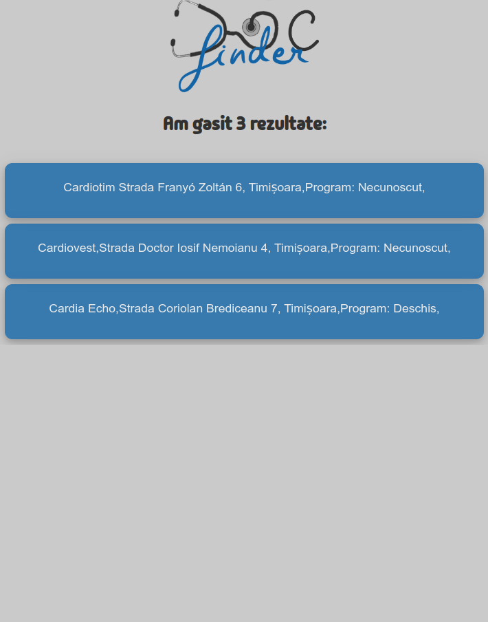

# DocFinder

Docfinder is a project made during the ITFest Hackathon 2024, specifically for the 'Health & Wellness" track.

# Project description
DocFinder is a responsive Web Application, which is 'mobile-first', meaning it is designed and developed with mobile users in mind. It is a **"vanilla" web application, created using HTML, CSS and JavaScript.**
It provides users with information regarding the location of the closest available doctors of a chosen specialty.

## Front page

## Result page

## 📋 Usage
The user selects a doctor specialty (*e.g. Cardiologist, Neurologist*).\
Using the **Google Places API for JavaScript** to fetch data regarding **working hours** and **distance from the user's location**, the application creates a list.
The top of the list contains doctor offices of the specified specialty that are the **closest in proximity** to the user.

## 🛠️ Technologies
- [Node.js](https://nodejs.org/en)
- [Express js](https://expressjs.com/)
- [Axios](https://axios-http.com/)
- HTML/CSS/Javascript

## Features to be added
- 

## Contributors (Team zero_daylight)

 - Sebastian Kalciov
 - Silviu Stefan Mitrea
 - Raul-Andrei Ariton
 - Maria Popescu

